<!-- markdownlint-capture -->
<!-- markdownlint-disable -->

# Code Metrics

This file is dynamically maintained by a bot, *please do not* edit this by hand. It represents various [code metrics](https://aka.ms/dotnet/code-metrics), such as cyclomatic complexity, maintainability index, and so on.

## AdventOfCode.Tests :heavy_check_mark:

The *AdventOfCode.Tests.csproj* project file contains:

- 1 namespaces.
- 6 named types.
- 139 total lines of source code.
- Approximately 43 lines of executable code.
- The highest cyclomatic complexity is 1 :heavy_check_mark:.

  <strong id="adventofcode-tests">
    AdventOfCode.Tests :heavy_check_mark:
  </strong>

 

The `AdventOfCode.Tests` namespace contains 6 named types.

- 6 named types.
- 139 total lines of source code.
- Approximately 43 lines of executable code.
- The highest cyclomatic complexity is 1 :heavy_check_mark:.

  <strong id="p01tests">
    P01Tests :heavy_check_mark:
  </strong>

 

- The `P01Tests` contains 2 members.
- 25 total lines of source code.
- Approximately 13 lines of executable code.
- The highest cyclomatic complexity is 1 :heavy_check_mark:.

| Member kind | Line number | Maintainability index | Cyclomatic complexity | Depth of inheritance | Class coupling | Lines of source / executable code |
| :-: | :-: | :-: | :-: | :-: | :-: | :-: |
| Method | <a href='https://github.com/dfar-io/aoc-2015/blob/main/AdventOfCode.Tests/P01Tests.cs#L19' title='void P01Tests.P01P1_Works(string input, int answer)'>19</a> | 64 | 1 :heavy_check_mark: | 0 | 4 | 14 / 10 |
| Method | <a href='https://github.com/dfar-io/aoc-2015/blob/main/AdventOfCode.Tests/P01Tests.cs#L27' title='void P01Tests.P01P2_Works(string input, int answer)'>27</a> | 81 | 1 :heavy_check_mark: | 0 | 4 | 7 / 3 |

<a href="#P01Tests-class-diagram">:link: to `P01Tests` class diagram</a>

<a href="#adventofcode-tests">:top: back to AdventOfCode.Tests</a>

  <strong id="p02tests">
    P02Tests :heavy_check_mark:
  </strong>

 

- The `P02Tests` contains 1 members.
- 12 total lines of source code.
- Approximately 5 lines of executable code.
- The highest cyclomatic complexity is 1 :heavy_check_mark:.

| Member kind | Line number | Maintainability index | Cyclomatic complexity | Depth of inheritance | Class coupling | Lines of source / executable code |
| :-: | :-: | :-: | :-: | :-: | :-: | :-: |
| Method | <a href='https://github.com/dfar-io/aoc-2015/blob/main/AdventOfCode.Tests/P02Tests.cs#L12' title='void P02Tests.Box_Works(string input, int surfaceArea, int ribbon)'>12</a> | 73 | 1 :heavy_check_mark: | 0 | 4 | 9 / 5 |

<a href="#P02Tests-class-diagram">:link: to `P02Tests` class diagram</a>

<a href="#adventofcode-tests">:top: back to AdventOfCode.Tests</a>

  <strong id="p03tests">
    P03Tests :heavy_check_mark:
  </strong>

 

- The `P03Tests` contains 1 members.
- 14 total lines of source code.
- Approximately 7 lines of executable code.
- The highest cyclomatic complexity is 1 :heavy_check_mark:.

| Member kind | Line number | Maintainability index | Cyclomatic complexity | Depth of inheritance | Class coupling | Lines of source / executable code |
| :-: | :-: | :-: | :-: | :-: | :-: | :-: |
| Method | <a href='https://github.com/dfar-io/aoc-2015/blob/main/AdventOfCode.Tests/P03Tests.cs#L14' title='void P03Tests.P03_Works(string input, int answer1, int answer2)'>14</a> | 69 | 1 :heavy_check_mark: | 0 | 4 | 11 / 7 |

<a href="#P03Tests-class-diagram">:link: to `P03Tests` class diagram</a>

<a href="#adventofcode-tests">:top: back to AdventOfCode.Tests</a>

  <strong id="p04tests">
    P04Tests :heavy_check_mark:
  </strong>

 

- The `P04Tests` contains 1 members.
- 11 total lines of source code.
- Approximately 4 lines of executable code.
- The highest cyclomatic complexity is 1 :heavy_check_mark:.

| Member kind | Line number | Maintainability index | Cyclomatic complexity | Depth of inheritance | Class coupling | Lines of source / executable code |
| :-: | :-: | :-: | :-: | :-: | :-: | :-: |
| Method | <a href='https://github.com/dfar-io/aoc-2015/blob/main/AdventOfCode.Tests/P04Tests.cs#L12' title='void P04Tests.P04_Works(string input, int answer1)'>12</a> | 77 | 1 :heavy_check_mark: | 0 | 4 | 8 / 4 |

<a href="#P04Tests-class-diagram">:link: to `P04Tests` class diagram</a>

<a href="#adventofcode-tests">:top: back to AdventOfCode.Tests</a>

  <strong id="p05tests">
    P05Tests :heavy_check_mark:
  </strong>

 

- The `P05Tests` contains 2 members.
- 31 total lines of source code.
- Approximately 6 lines of executable code.
- The highest cyclomatic complexity is 1 :heavy_check_mark:.

| Member kind | Line number | Maintainability index | Cyclomatic complexity | Depth of inheritance | Class coupling | Lines of source / executable code |
| :-: | :-: | :-: | :-: | :-: | :-: | :-: |
| Method | <a href='https://github.com/dfar-io/aoc-2015/blob/main/AdventOfCode.Tests/P05Tests.cs#L10' title='void P05Tests.P05P1_Works()'>10</a> | 78 | 1 :heavy_check_mark: | 0 | 3 | 14 / 3 |
| Method | <a href='https://github.com/dfar-io/aoc-2015/blob/main/AdventOfCode.Tests/P05Tests.cs#L25' title='void P05Tests.P05P2_Works()'>25</a> | 79 | 1 :heavy_check_mark: | 0 | 3 | 13 / 3 |

<a href="#P05Tests-class-diagram">:link: to `P05Tests` class diagram</a>

<a href="#adventofcode-tests">:top: back to AdventOfCode.Tests</a>

  <strong id="p06tests">
    P06Tests :heavy_check_mark:
  </strong>

 

- The `P06Tests` contains 2 members.
- 34 total lines of source code.
- Approximately 8 lines of executable code.
- The highest cyclomatic complexity is 1 :heavy_check_mark:.

| Member kind | Line number | Maintainability index | Cyclomatic complexity | Depth of inheritance | Class coupling | Lines of source / executable code |
| :-: | :-: | :-: | :-: | :-: | :-: | :-: |
| Method | <a href='https://github.com/dfar-io/aoc-2015/blob/main/AdventOfCode.Tests/P06Tests.cs#L13' title='void P06Tests.Instruction_Inits(string instructionString, string command, int startX, int startY, int endX, int endY)'>13</a> | 72 | 1 :heavy_check_mark: | 0 | 5 | 18 / 5 |
| Method | <a href='https://github.com/dfar-io/aoc-2015/blob/main/AdventOfCode.Tests/P06Tests.cs#L29' title='void P06Tests.P06_Works()'>29</a> | 79 | 1 :heavy_check_mark: | 0 | 3 | 12 / 3 |

<a href="#P06Tests-class-diagram">:link: to `P06Tests` class diagram</a>

<a href="#adventofcode-tests">:top: back to AdventOfCode.Tests</a>

<a href="#adventofcode-tests">:top: back to AdventOfCode.Tests</a>

## AdventOfCode :warning:

The *AdventOfCode.csproj* project file contains:

- 8 namespaces.
- 12 named types.
- 383 total lines of source code.
- Approximately 125 lines of executable code.
- The highest cyclomatic complexity is 8 :warning:.

  <strong id="global+namespace">
    &lt;global namespace&gt; :heavy_check_mark:
  </strong>

 

The `<global namespace>` namespace contains 1 named types.

- 1 named types.
- 13 total lines of source code.
- Approximately 12 lines of executable code.
- The highest cyclomatic complexity is 3 :heavy_check_mark:.

  <strong id="program$">
    &lt;Program&gt;$ :heavy_check_mark:
  </strong>

 

- The `<Program>$` contains 1 members.
- 13 total lines of source code.
- Approximately 12 lines of executable code.
- The highest cyclomatic complexity is 3 :heavy_check_mark:.

| Member kind | Line number | Maintainability index | Cyclomatic complexity | Depth of inheritance | Class coupling | Lines of source / executable code |
| :-: | :-: | :-: | :-: | :-: | :-: | :-: |
| Method | <a href='https://github.com/dfar-io/aoc-2015/blob/main/AdventOfCode/Program.cs#L1' title='<top-level-statements-entry-point>'>1</a> | 68 | 3 :heavy_check_mark: | 0 | 5 | 13 / 6 |

<a href="#global+namespace">:top: back to &lt;global namespace&gt;</a>

  <strong id="adventofcode-problems-p01">
    AdventOfCode.Problems.P01 :heavy_check_mark:
  </strong>

 

The `AdventOfCode.Problems.P01` namespace contains 1 named types.

- 1 named types.
- 23 total lines of source code.
- Approximately 9 lines of executable code.
- The highest cyclomatic complexity is 4 :heavy_check_mark:.

  <strong id="p01">
    P01 :heavy_check_mark:
  </strong>

 

- The `P01` contains 2 members.
- 20 total lines of source code.
- Approximately 9 lines of executable code.
- The highest cyclomatic complexity is 4 :heavy_check_mark:.

| Member kind | Line number | Maintainability index | Cyclomatic complexity | Depth of inheritance | Class coupling | Lines of source / executable code |
| :-: | :-: | :-: | :-: | :-: | :-: | :-: |
| Method | <a href='https://github.com/dfar-io/aoc-2015/blob/main/AdventOfCode/Problems/P01/P01.cs#L7' title='P01.P01(string input)'>7</a> | 100 | 1 :heavy_check_mark: | 0 | 0 | 1 / 0 |
| Method | <a href='https://github.com/dfar-io/aoc-2015/blob/main/AdventOfCode/Problems/P01/P01.cs#L9' title='P01.P01(string[] input)'>9</a> | 62 | 4 :heavy_check_mark: | 0 | 2 | 15 / 9 |

<a href="#P01-class-diagram">:link: to `P01` class diagram</a>

<a href="#adventofcode-problems-p01">:top: back to AdventOfCode.Problems.P01</a>

  <strong id="adventofcode-problems-p02">
    AdventOfCode.Problems.P02 :heavy_check_mark:
  </strong>

 

The `AdventOfCode.Problems.P02` namespace contains 2 named types.

- 2 named types.
- 65 total lines of source code.
- Approximately 22 lines of executable code.
- The highest cyclomatic complexity is 2 :heavy_check_mark:.

  <strong id="box">
    Box :heavy_check_mark:
  </strong>

 

- The `Box` contains 11 members.
- 51 total lines of source code.
- Approximately 18 lines of executable code.
- The highest cyclomatic complexity is 2 :heavy_check_mark:.

| Member kind | Line number | Maintainability index | Cyclomatic complexity | Depth of inheritance | Class coupling | Lines of source / executable code |
| :-: | :-: | :-: | :-: | :-: | :-: | :-: |
| Method | <a href='https://github.com/dfar-io/aoc-2015/blob/main/AdventOfCode/Problems/P02/Box.cs#L13' title='Box.Box(string input)'>13</a> | 74 | 1 :heavy_check_mark: | 0 | 1 | 8 / 4 |
| Property | <a href='https://github.com/dfar-io/aoc-2015/blob/main/AdventOfCode/Problems/P02/Box.cs#L9' title='int Box.Area1'>9</a> | 94 | 2 :heavy_check_mark: | 0 | 1 | 1 / 2 |
| Property | <a href='https://github.com/dfar-io/aoc-2015/blob/main/AdventOfCode/Problems/P02/Box.cs#L10' title='int Box.Area2'>10</a> | 94 | 2 :heavy_check_mark: | 0 | 1 | 1 / 2 |
| Property | <a href='https://github.com/dfar-io/aoc-2015/blob/main/AdventOfCode/Problems/P02/Box.cs#L11' title='int Box.Area3'>11</a> | 94 | 2 :heavy_check_mark: | 0 | 1 | 1 / 2 |
| Property | <a href='https://github.com/dfar-io/aoc-2015/blob/main/AdventOfCode/Problems/P02/Box.cs#L7' title='int Box.Height'>7</a> | 100 | 2 :heavy_check_mark: | 0 | 0 | 1 / 0 |
| Property | <a href='https://github.com/dfar-io/aoc-2015/blob/main/AdventOfCode/Problems/P02/Box.cs#L5' title='int Box.Length'>5</a> | 100 | 2 :heavy_check_mark: | 0 | 0 | 1 / 0 |
| Method | <a href='https://github.com/dfar-io/aoc-2015/blob/main/AdventOfCode/Problems/P02/Box.cs#L30' title='int Box.Ribbon()'>30</a> | 82 | 1 :heavy_check_mark: | 0 | 1 | 5 / 2 |
| Method | <a href='https://github.com/dfar-io/aoc-2015/blob/main/AdventOfCode/Problems/P02/Box.cs#L38' title='int Box.SmallestArea()'>38</a> | 93 | 1 :heavy_check_mark: | 0 | 1 | 7 / 1 |
| Method | <a href='https://github.com/dfar-io/aoc-2015/blob/main/AdventOfCode/Problems/P02/Box.cs#L46' title='int Box.SmallestPerimeter()'>46</a> | 73 | 1 :heavy_check_mark: | 0 | 1 | 7 / 4 |
| Method | <a href='https://github.com/dfar-io/aoc-2015/blob/main/AdventOfCode/Problems/P02/Box.cs#L22' title='int Box.SurfaceAreaPlus()'>22</a> | 88 | 1 :heavy_check_mark: | 0 | 1 | 7 / 1 |
| Property | <a href='https://github.com/dfar-io/aoc-2015/blob/main/AdventOfCode/Problems/P02/Box.cs#L6' title='int Box.Width'>6</a> | 100 | 2 :heavy_check_mark: | 0 | 0 | 1 / 0 |

<a href="#Box-class-diagram">:link: to `Box` class diagram</a>

<a href="#adventofcode-problems-p02">:top: back to AdventOfCode.Problems.P02</a>

  <strong id="p02">
    P02 :heavy_check_mark:
  </strong>

 

- The `P02` contains 1 members.
- 12 total lines of source code.
- Approximately 4 lines of executable code.
- The highest cyclomatic complexity is 2 :heavy_check_mark:.

| Member kind | Line number | Maintainability index | Cyclomatic complexity | Depth of inheritance | Class coupling | Lines of source / executable code |
| :-: | :-: | :-: | :-: | :-: | :-: | :-: |
| Method | <a href='https://github.com/dfar-io/aoc-2015/blob/main/AdventOfCode/Problems/P02/P02.cs#L5' title='P02.P02(string[] input)'>5</a> | 74 | 2 :heavy_check_mark: | 0 | 3 | 9 / 4 |

<a href="#P02-class-diagram">:link: to `P02` class diagram</a>

<a href="#adventofcode-problems-p02">:top: back to AdventOfCode.Problems.P02</a>

  <strong id="adventofcode-problems-p03">
    AdventOfCode.Problems.P03 :heavy_check_mark:
  </strong>

 

The `AdventOfCode.Problems.P03` namespace contains 1 named types.

- 1 named types.
- 66 total lines of source code.
- Approximately 23 lines of executable code.
- The highest cyclomatic complexity is 5 :heavy_check_mark:.

  <strong id="p03">
    P03 :heavy_check_mark:
  </strong>

 

- The `P03` contains 3 members.
- 65 total lines of source code.
- Approximately 23 lines of executable code.
- The highest cyclomatic complexity is 5 :heavy_check_mark:.

| Member kind | Line number | Maintainability index | Cyclomatic complexity | Depth of inheritance | Class coupling | Lines of source / executable code |
| :-: | :-: | :-: | :-: | :-: | :-: | :-: |
| Method | <a href='https://github.com/dfar-io/aoc-2015/blob/main/AdventOfCode/Problems/P03/P03.cs#L5' title='P03.P03(string input)'>5</a> | 100 | 1 :heavy_check_mark: | 0 | 0 | 1 / 0 |
| Method | <a href='https://github.com/dfar-io/aoc-2015/blob/main/AdventOfCode/Problems/P03/P03.cs#L7' title='P03.P03(string[] input)'>7</a> | 53 | 4 :heavy_check_mark: | 0 | 4 | 37 / 22 |
| Method | <a href='https://github.com/dfar-io/aoc-2015/blob/main/AdventOfCode/Problems/P03/P03.cs#L45' title='void P03.HandleDirection(ref (int x, int y) p1Coords, char direction, ref (int x, int y) p2Coords)'>45</a> | 85 | 5 :heavy_check_mark: | 0 | 2 | 22 / 1 |

<a href="#P03-class-diagram">:link: to `P03` class diagram</a>

<a href="#adventofcode-problems-p03">:top: back to AdventOfCode.Problems.P03</a>

  <strong id="adventofcode-problems-p04">
    AdventOfCode.Problems.P04 :heavy_check_mark:
  </strong>

 

The `AdventOfCode.Problems.P04` namespace contains 1 named types.

- 1 named types.
- 43 total lines of source code.
- Approximately 15 lines of executable code.
- The highest cyclomatic complexity is 6 :heavy_check_mark:.

  <strong id="p04">
    P04 :heavy_check_mark:
  </strong>

 

- The `P04` contains 3 members.
- 41 total lines of source code.
- Approximately 15 lines of executable code.
- The highest cyclomatic complexity is 6 :heavy_check_mark:.

| Member kind | Line number | Maintainability index | Cyclomatic complexity | Depth of inheritance | Class coupling | Lines of source / executable code |
| :-: | :-: | :-: | :-: | :-: | :-: | :-: |
| Method | <a href='https://github.com/dfar-io/aoc-2015/blob/main/AdventOfCode/Problems/P04/P04.cs#L7' title='P04.P04(string input)'>7</a> | 100 | 1 :heavy_check_mark: | 0 | 0 | 1 / 0 |
| Method | <a href='https://github.com/dfar-io/aoc-2015/blob/main/AdventOfCode/Problems/P04/P04.cs#L9' title='P04.P04(string[] input)'>9</a> | 64 | 6 :heavy_check_mark: | 0 | 2 | 18 / 8 |
| Method | <a href='https://github.com/dfar-io/aoc-2015/blob/main/AdventOfCode/Problems/P04/P04.cs#L28' title='string P04.FindMD5Hash(string input)'>28</a> | 68 | 2 :heavy_check_mark: | 0 | 3 | 17 / 7 |

<a href="#P04-class-diagram">:link: to `P04` class diagram</a>

<a href="#adventofcode-problems-p04">:top: back to AdventOfCode.Problems.P04</a>

  <strong id="adventofcode-problems-p05">
    AdventOfCode.Problems.P05 :warning:
  </strong>

 

The `AdventOfCode.Problems.P05` namespace contains 2 named types.

- 2 named types.
- 60 total lines of source code.
- Approximately 21 lines of executable code.
- The highest cyclomatic complexity is 8 :warning:.

  <strong id="p05">
    P05 :heavy_check_mark:
  </strong>

 

- The `P05` contains 2 members.
- 10 total lines of source code.
- Approximately 4 lines of executable code.
- The highest cyclomatic complexity is 1 :heavy_check_mark:.

| Member kind | Line number | Maintainability index | Cyclomatic complexity | Depth of inheritance | Class coupling | Lines of source / executable code |
| :-: | :-: | :-: | :-: | :-: | :-: | :-: |
| Method | <a href='https://github.com/dfar-io/aoc-2015/blob/main/AdventOfCode/Problems/P05/P05.cs#L7' title='P05.P05(string input)'>7</a> | 100 | 1 :heavy_check_mark: | 0 | 0 | 1 / 0 |
| Method | <a href='https://github.com/dfar-io/aoc-2015/blob/main/AdventOfCode/Problems/P05/P05.cs#L9' title='P05.P05(string[] input)'>9</a> | 77 | 1 :heavy_check_mark: | 0 | 2 | 5 / 4 |

<a href="#P05-class-diagram">:link: to `P05` class diagram</a>

<a href="#adventofcode-problems-p05">:top: back to AdventOfCode.Problems.P05</a>

  <strong id="p05extensions">
    P05Extensions :warning:
  </strong>

 

- The `P05Extensions` contains 2 members.
- 46 total lines of source code.
- Approximately 17 lines of executable code.
- The highest cyclomatic complexity is 8 :warning:.

| Member kind | Line number | Maintainability index | Cyclomatic complexity | Depth of inheritance | Class coupling | Lines of source / executable code |
| :-: | :-: | :-: | :-: | :-: | :-: | :-: |
| Method | <a href='https://github.com/dfar-io/aoc-2015/blob/main/AdventOfCode/Problems/P05/P05Extensions.cs#L7' title='bool P05Extensions.IsNice(string value)'>7</a> | 67 | 6 :heavy_check_mark: | 0 | 1 | 14 / 6 |
| Method | <a href='https://github.com/dfar-io/aoc-2015/blob/main/AdventOfCode/Problems/P05/P05Extensions.cs#L22' title='bool P05Extensions.IsNiceP2(string value)'>22</a> | 58 | 8 :warning: | 0 | 1 | 28 / 11 |

<a href="#P05Extensions-class-diagram">:link: to `P05Extensions` class diagram</a>

<a href="#adventofcode-problems-p05">:top: back to AdventOfCode.Problems.P05</a>

  <strong id="adventofcode-problems-p06">
    AdventOfCode.Problems.P06 :heavy_check_mark:
  </strong>

 

The `AdventOfCode.Problems.P06` namespace contains 3 named types.

- 3 named types.
- 103 total lines of source code.
- Approximately 23 lines of executable code.
- The highest cyclomatic complexity is 6 :heavy_check_mark:.

  <strong id="coordinate">
    Coordinate :heavy_check_mark:
  </strong>

 

- The `Coordinate` contains 3 members.
- 11 total lines of source code.
- Approximately 2 lines of executable code.
- The highest cyclomatic complexity is 2 :heavy_check_mark:.

| Member kind | Line number | Maintainability index | Cyclomatic complexity | Depth of inheritance | Class coupling | Lines of source / executable code |
| :-: | :-: | :-: | :-: | :-: | :-: | :-: |
| Method | <a href='https://github.com/dfar-io/aoc-2015/blob/main/AdventOfCode/Problems/P06/Coordinate.cs#L10' title='Coordinate.Coordinate(int x, int y)'>10</a> | 85 | 1 :heavy_check_mark: | 0 | 0 | 5 / 2 |
| Property | <a href='https://github.com/dfar-io/aoc-2015/blob/main/AdventOfCode/Problems/P06/Coordinate.cs#L7' title='int Coordinate.X'>7</a> | 100 | 2 :heavy_check_mark: | 0 | 0 | 1 / 0 |
| Property | <a href='https://github.com/dfar-io/aoc-2015/blob/main/AdventOfCode/Problems/P06/Coordinate.cs#L8' title='int Coordinate.Y'>8</a> | 100 | 2 :heavy_check_mark: | 0 | 0 | 1 / 0 |

<a href="#Coordinate-class-diagram">:link: to `Coordinate` class diagram</a>

<a href="#adventofcode-problems-p06">:top: back to AdventOfCode.Problems.P06</a>

  <strong id="instruction">
    Instruction :heavy_check_mark:
  </strong>

 

- The `Instruction` contains 4 members.
- 24 total lines of source code.
- Approximately 7 lines of executable code.
- The highest cyclomatic complexity is 2 :heavy_check_mark:.

| Member kind | Line number | Maintainability index | Cyclomatic complexity | Depth of inheritance | Class coupling | Lines of source / executable code |
| :-: | :-: | :-: | :-: | :-: | :-: | :-: |
| Method | <a href='https://github.com/dfar-io/aoc-2015/blob/main/AdventOfCode/Problems/P06/Instruction.cs#L11' title='Instruction.Instruction(string input)'>11</a> | 65 | 2 :heavy_check_mark: | 0 | 2 | 17 / 7 |
| Property | <a href='https://github.com/dfar-io/aoc-2015/blob/main/AdventOfCode/Problems/P06/Instruction.cs#L7' title='string Instruction.Command'>7</a> | 100 | 2 :heavy_check_mark: | 0 | 0 | 1 / 0 |
| Property | <a href='https://github.com/dfar-io/aoc-2015/blob/main/AdventOfCode/Problems/P06/Instruction.cs#L9' title='Coordinate Instruction.End'>9</a> | 100 | 2 :heavy_check_mark: | 0 | 1 | 1 / 0 |
| Property | <a href='https://github.com/dfar-io/aoc-2015/blob/main/AdventOfCode/Problems/P06/Instruction.cs#L8' title='Coordinate Instruction.Start'>8</a> | 100 | 2 :heavy_check_mark: | 0 | 1 | 1 / 0 |

<a href="#Instruction-class-diagram">:link: to `Instruction` class diagram</a>

<a href="#adventofcode-problems-p06">:top: back to AdventOfCode.Problems.P06</a>

  <strong id="p06">
    P06 :heavy_check_mark:
  </strong>

 

- The `P06` contains 4 members.
- 62 total lines of source code.
- Approximately 14 lines of executable code.
- The highest cyclomatic complexity is 6 :heavy_check_mark:.

| Member kind | Line number | Maintainability index | Cyclomatic complexity | Depth of inheritance | Class coupling | Lines of source / executable code |
| :-: | :-: | :-: | :-: | :-: | :-: | :-: |
| Method | <a href='https://github.com/dfar-io/aoc-2015/blob/main/AdventOfCode/Problems/P06/P06.cs#L7' title='P06.P06(string input)'>7</a> | 100 | 1 :heavy_check_mark: | 0 | 0 | 1 / 0 |
| Method | <a href='https://github.com/dfar-io/aoc-2015/blob/main/AdventOfCode/Problems/P06/P06.cs#L9' title='P06.P06(string[] input)'>9</a> | 58 | 4 :heavy_check_mark: | 0 | 4 | 27 / 12 |
| Method | <a href='https://github.com/dfar-io/aoc-2015/blob/main/AdventOfCode/Problems/P06/P06.cs#L37' title='bool P06.HandleLight(bool light, string command)'>37</a> | 87 | 5 :heavy_check_mark: | 0 | 3 | 14 / 1 |
| Method | <a href='https://github.com/dfar-io/aoc-2015/blob/main/AdventOfCode/Problems/P06/P06.cs#L52' title='int P06.HandleLightP2(int light, string command)'>52</a> | 85 | 6 :heavy_check_mark: | 0 | 3 | 14 / 1 |

<a href="#P06-class-diagram">:link: to `P06` class diagram</a>

<a href="#adventofcode-problems-p06">:top: back to AdventOfCode.Problems.P06</a>

  <strong id="adventofcode-problems">
    AdventOfCode.Problems :heavy_check_mark:
  </strong>

 

The `AdventOfCode.Problems` namespace contains 1 named types.

- 1 named types.
- 10 total lines of source code.
- Approximately 0 lines of executable code.
- The highest cyclomatic complexity is 2 :heavy_check_mark:.

  <strong id="problem">
    Problem :heavy_check_mark:
  </strong>

 

- The `Problem` contains 4 members.
- 9 total lines of source code.
- Approximately 0 lines of executable code.
- The highest cyclomatic complexity is 2 :heavy_check_mark:.

| Member kind | Line number | Maintainability index | Cyclomatic complexity | Depth of inheritance | Class coupling | Lines of source / executable code |
| :-: | :-: | :-: | :-: | :-: | :-: | :-: |
| Method | <a href='https://github.com/dfar-io/aoc-2015/blob/main/AdventOfCode/Problems/Problem.cs#L8' title='Problem.Problem(string input)'>8</a> | 100 | 1 :heavy_check_mark: | 0 | 0 | 1 / 0 |
| Method | <a href='https://github.com/dfar-io/aoc-2015/blob/main/AdventOfCode/Problems/Problem.cs#L10' title='Problem.Problem(string[] input)'>10</a> | 100 | 1 :heavy_check_mark: | 0 | 0 | 1 / 0 |
| Property | <a href='https://github.com/dfar-io/aoc-2015/blob/main/AdventOfCode/Problems/Problem.cs#L5' title='int Problem.Answer1'>5</a> | 100 | 2 :heavy_check_mark: | 0 | 0 | 1 / 0 |
| Property | <a href='https://github.com/dfar-io/aoc-2015/blob/main/AdventOfCode/Problems/Problem.cs#L6' title='int Problem.Answer2'>6</a> | 100 | 2 :heavy_check_mark: | 0 | 0 | 1 / 0 |

<a href="#Problem-class-diagram">:link: to `Problem` class diagram</a>

<a href="#adventofcode-problems">:top: back to AdventOfCode.Problems</a>

<a href="#adventofcode">:top: back to AdventOfCode</a>

## Metric definitions

  - **Maintainability index**: Measures ease of code maintenance. Higher values are better.
  - **Cyclomatic complexity**: Measures the number of branches. Lower values are better.
  - **Depth of inheritance**: Measures length of object inheritance hierarchy. Lower values are better.
  - **Class coupling**: Measures the number of classes that are referenced. Lower values are better.
  - **Lines of source code**: Exact number of lines of source code. Lower values are better.
  - **Lines of executable code**: Approximates the lines of executable code. Lower values are better.

## Mermaid class diagrams

##### `P01Tests` class diagram

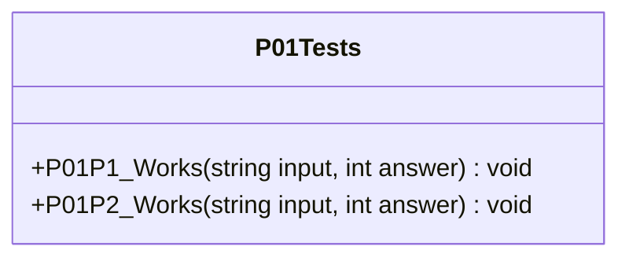

##### `P02Tests` class diagram

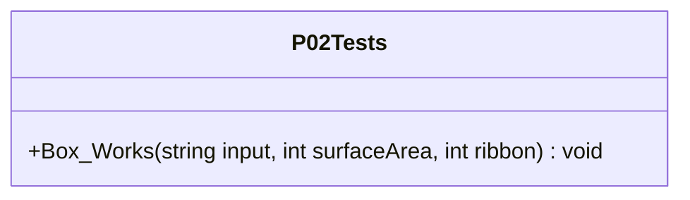

##### `P03Tests` class diagram

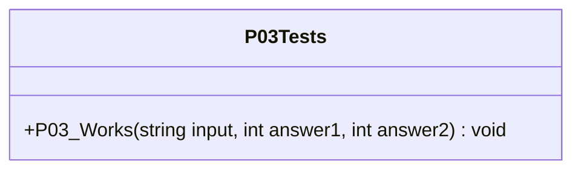

##### `P04Tests` class diagram

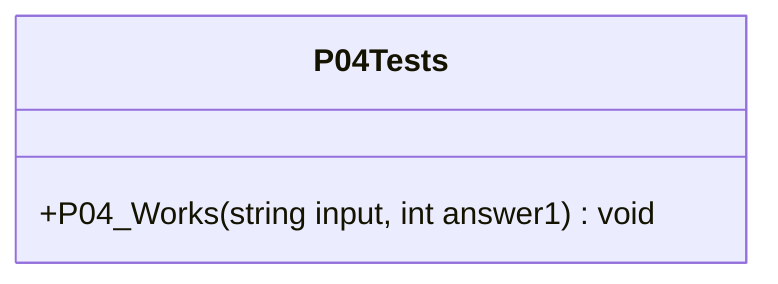

##### `P05Tests` class diagram

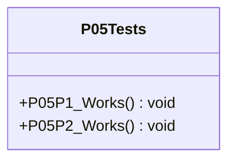

##### `P06Tests` class diagram

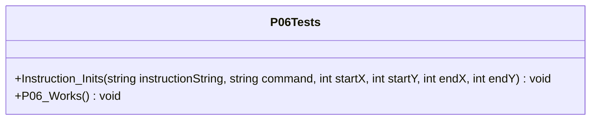

##### `P01` class diagram

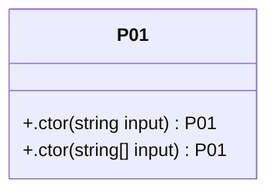

##### `Box` class diagram

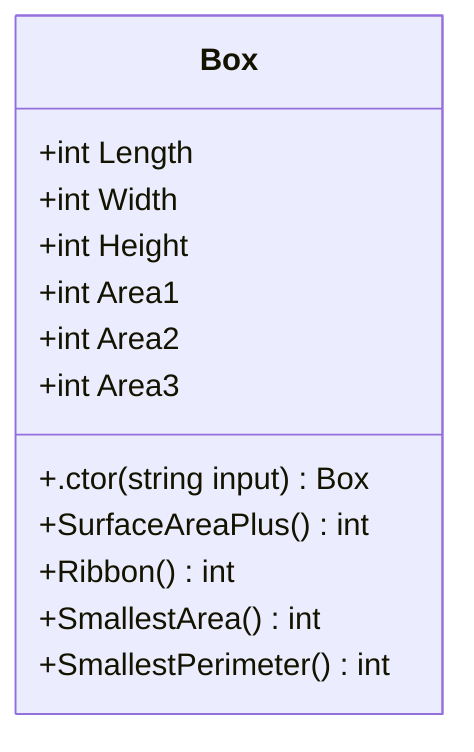

##### `P02` class diagram

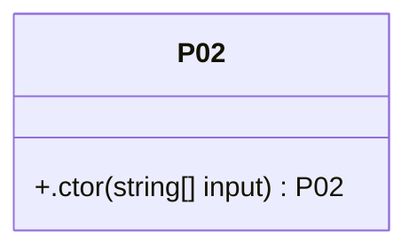

##### `P03` class diagram

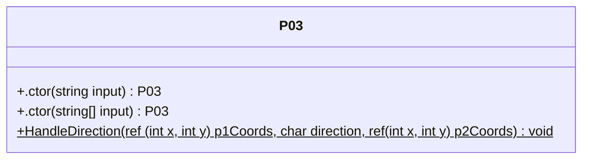

##### `P04` class diagram

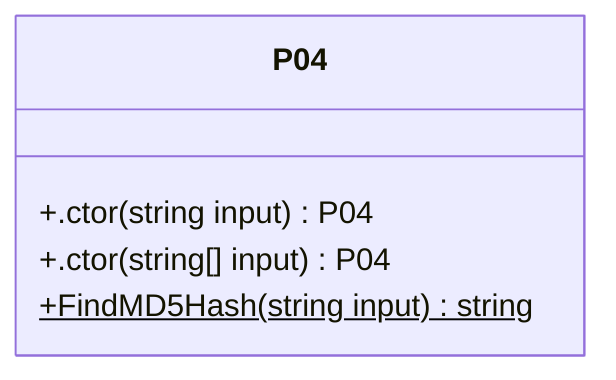

##### `P05` class diagram

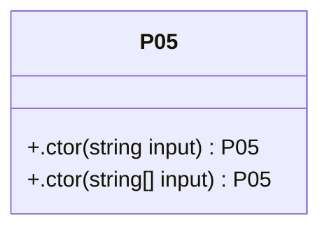

##### `P05Extensions` class diagram

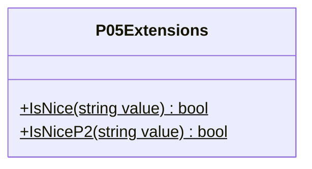

##### `Coordinate` class diagram

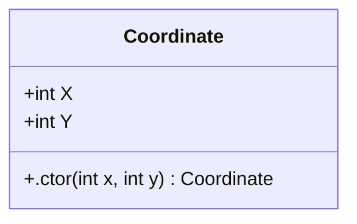

##### `Instruction` class diagram

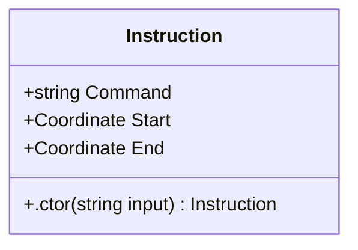

##### `P06` class diagram

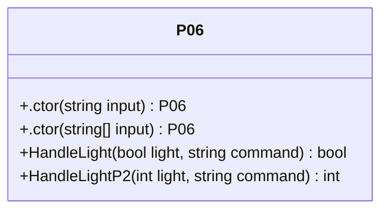

##### `Problem` class diagram

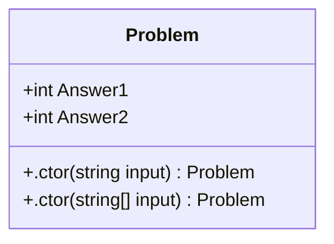

*This file is maintained by a bot.*

<!-- markdownlint-restore -->
